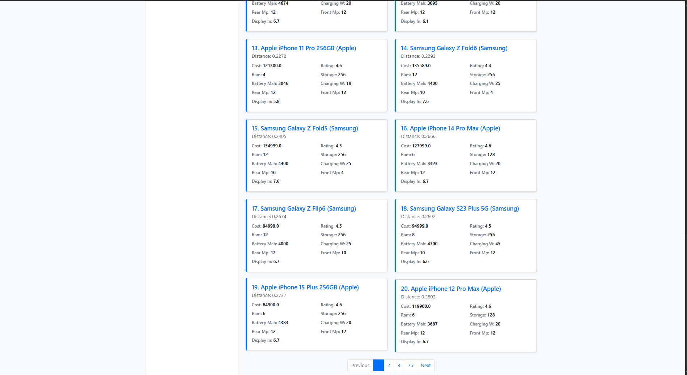

# 📱 KD-Tree Mobile Recommender

A high-performance mobile recommendation system that suggests similar smartphones using **KD-Tree based nearest neighbor search** combined with **multi-feature filtering**.

---

## 🚀 Overview

This project builds an intelligent recommendation engine that helps users find the best alternative smartphones based on specifications like price, RAM, battery, storage, and more.

Unlike traditional filtering systems, this project leverages:

* ⚡ **KD-Tree for fast similarity search**
* 🎯 **K-Nearest Neighbors (KNN)**
* 🔍 **Multi-dimensional feature filtering**
* 🌐 **Interactive web interface using Flask**

---

## 🧠 Key Features

* 🔎 Smart search with autocomplete suggestions
* 📊 Multi-feature filtering (price, RAM, battery, etc.)
* ⚡ Fast similarity search using KD-Tree
* 🎯 KNN-based recommendation system
* 📄 Pagination for scalable results
* 🌐 Clean and responsive UI

---

## 🖥️ Demo Interface

### 🔍 Search & Autocomplete


### 📊 Recommendations + Filters


### 📄 Pagination System


---

## ⚙️ Tech Stack

* **Python**
* **Flask**
* **Pandas / NumPy**
* **KD-Tree (Scikit-learn or custom implementation)**
* **HTML / CSS (Bootstrap)**

---

## 🧪 Methodology

* Load dataset using Pandas
* Clean and parse specifications
* Normalize features to range [0, 1]
* Convert each mobile into feature vectors
* Build KD-Tree for efficient search
* Apply user filters (range queries)
* Perform KNN search on filtered data
* Return top similar mobiles

---

## ⚡ How It Works

1. User selects a phone or starts typing
2. System encodes it into a feature vector
3. Filters reduce search space
4. KD-Tree performs nearest neighbor search
5. Results are ranked and displayed

---

## ▶️ Run Locally

```bash
git clone https://github.com/your-username/kd-tree-phone-recommender.git
cd kd-tree-phone-recommender
pip install -r requirements.txt
python app.py
```

---

## 📂 Dataset

* Cleaned mobile dataset with structured specifications
* Stored in: `data/cleaned_dataset.csv`

---

## 💡 Why KD-Tree?

Traditional search is **O(n)**, but KD-Tree reduces it to:

👉 **O(log n)** (average case)

This makes the system scalable for large datasets.

---

## 📌 Future Improvements

* Deploy on cloud (Render / AWS)
* Add user preference learning
* Improve ranking using weighted similarity
* Add comparison view between phones

---

## 🧑‍💻 Author

**Praneeth D**

---

## 📜 License

MIT License
